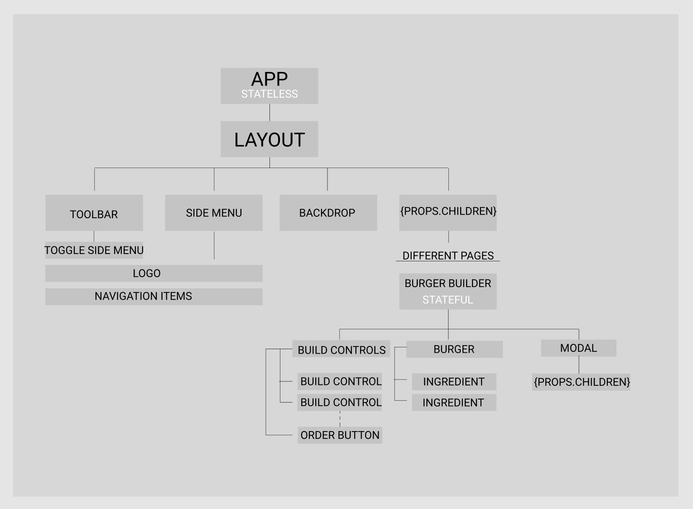
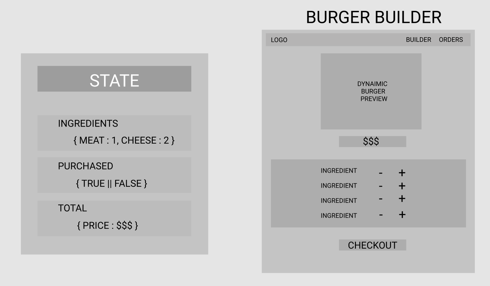

## [Burger Builder: Udemy - Maximilian Schwarzmüller](https://www.udemy.com/course/react-the-complete-guide-incl-redux/)


# TABLE OF CONTENTS
### 1-2 -Javascript
- [udemy-javascript](https://github.com/h-griffin/udemy-javascript)

### 3-7 -React
- [udemy-react](https://github.com/h-griffin/udemy-react)

## 8 -Burger Builder : Basic

- planning a react app
    - component tree/structure
    - application state
    - components vs containers





> $ npm run eject 
**webpack.config.dev.js**
**webpack.config.prod.js**

```
test: /\.css$/,
use: [
    require.resolve('style-loader'),
...
modules: true,
localIdentName: '[name]__[local]__[hash:base64:5]'

```

componetns - stateless
containers - stateful

### 9 -HTTP / Ajax
- [blog-react-udemy](https://github.com/h-griffin/blog-react-udemy)

## 10 -Burger Builder : Server

- [firebase backend :google](https://firebase.google.com/) 
- [burger-builder-react database](https://console.firebase.google.com/u/0/project/burger-builder-react-88892/database/burger-builder-react-88892/data)
    - realtime database - sort of like mongoDB, no tables just big object
    - fire base post// give base url and node name +.json ```url/orders.json```

